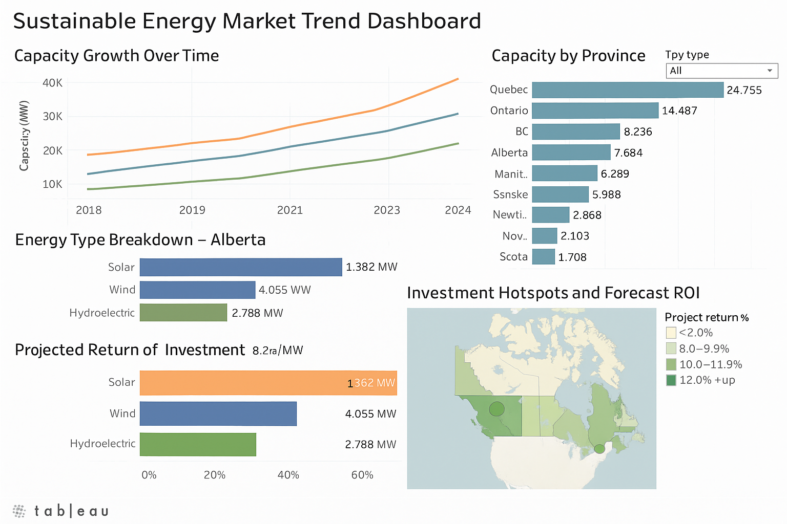

# Sustainable Energy Market Trend Dashboard

##  Project Overview
This project visualizes and analyzes renewable energy trends across Canadian provinces to support strategic planning and investment in the clean energy sector. It simulates how a company or policymaker might use data to inform expansion decisions and highlight growth areas in solar, wind, and hydro energy.
##  Dashboard Preview

##  Problem Statement
The transition to clean energy requires clear visibility into where infrastructure is growing and where investment yields the highest returns. This dashboard provides:
- Provincial comparisons of installed capacity over time
- Growth forecasts per energy type
- Investment ROI analysis based on regional policies

##  Directory Structure
```
sustainable-energy-trend-dashboard/
├── README.md
├── data/
│   └── renewable_energy_by_province.csv
├── notebooks/
│   └── energy_trend_analysis.ipynb
├── dashboard/
│   └── energy_market_dashboard.twbx
│   └── dashboard_screenshot.png
└── report.pdf (optional)
```

##  Tools & Technologies
- Tableau / Excel
- Python (Pandas, Plotly for preprocessing)
- Public datasets from NRCan & Open Canada

##  KPIs Tracked
- Installed Capacity (MW) by Region & Type
- Annual Growth Rate per Province
- Forecasted Capacity 2025–2030
- ROI per Province based on growth + subsidies

##  Key Insights
- Ontario and British Columbia show the highest multi-source renewable potential.
- Alberta’s wind capacity has grown by over 30% in the last two years.
- Forecasting suggests a **25% solar increase** by 2030 in key provinces.


##  Audience
- Clean energy consultants
- Government analysts and policymakers
- Sustainability-focused business strategists

##  Next Steps
- Add carbon offset equivalencies for clearer impact
- Link subsidies/incentives per region for investment simulation
- Create interactive map with province-level drilldowns
